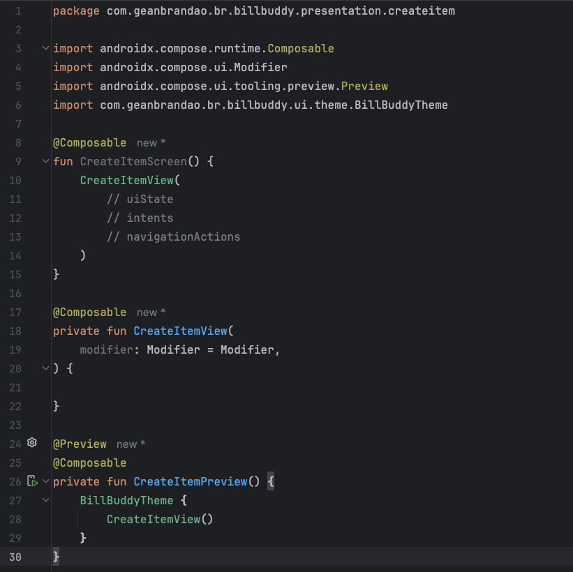

### Racha Conta
Em Inglês:
SplitMate
ShareTab
DivvyDine
CheckSplitter
BillBuddy

Em Português:
DividirConta
DivideAí
RachaConta
CompartilhaConta
DiviConta

### Configuração de projeto

#### Adicionar plugin do ksp.
``build.gradle.kts(:Project)``
```groovy
alias(libs.plugins.google.devtools.ksp) apply false
```

``build.gradle.kts(:app)``
````groovy 
alias(libs.plugins.google.devtools.ksp)
````

#### Adicionar dependências do koin
````groovy
// KOIN
implementation(libs.koin.core)
implementation(libs.koin.annotations)
implementation(libs.koin.androidx.compose)
ksp(libs.koin.ksp.compiler)
````

#### Configurar arquivos gerados pelo KSP
Adicionar check do koin em tempo de compilação
````groovy
ksp {
    arg("KOIN_CONFIG_CHECK","true")
}
````
Adicionar uso dos arquivos gerados pelo ksp
```groovy
applicationVariants.forEach { variant ->
    kotlin.sourceSets {
        getByName(name) {
            kotlin.srcDir("build/generated/ksp/${variant.name}/kotlin")
        }
    }
}
```

#### Adicionar dependências do room
````groovy
// ROOM
implementation(libs.androidx.room.runtime)
implementation(libs.androidx.room.ktx)
ksp(libs.androidx.room.compiler)
````
#### Configurar arquivos gerados pelo KSP
Adicionar localizacao do schema
````groovy
ksp {
    arg("room.schemaLocation", "$projectDir/schemas")
}
````

# Estrutura para Criação de Telas

Comecei a explorar o Jetpack Compose no início de 2021 e desde então experimentei diferentes abordagens e padrões para criar telas de aplicativos. Ao longo do tempo, desenvolvi uma estrutura que considero simples, limpa e fácil de manter.

## Estrutura de Arquivos

Organizo meus arquivos de tela da seguinte maneira:

- **`NomeDaTelaScreen.kt`**: Arquivo principal que define a estrutura da tela usando Compose.
- **`NomeDaTelaViewModel.kt`**: Contém a lógica de negócios relacionada à tela.
- **`NomeDaTelaUiState.kt`**: Representa o estado atual da tela.
- **`NomeDaTelaIntent ou NomeDaTelaAction.kt`**: Lida com as ações e intenções da tela.
- **`NomeDaTelaNavigation.kt`**: Gerencia a navegação entre telas.

## Componentes Reutilizáveis

Utilizo um arquivo `components`, dentro do package da tela para separar os diferentes componentes da tela, o que torna o arquivo principal da tela mais legível. Se a tela se tornar muito complexa, crio arquivos separados para grupos de componentes específicos, como:

- **`InputComponents.kt`**: Componentes relacionados à entrada de dados.
- **`ListComponents.kt`**: Componentes para exibir listas.

Para componentes comuns a várias telas (por exemplo, um campo de entrada de dados), mantenho-os em um package `common` dentro do package `presentation`. Dessa forma, os arquivos de componentes da tela podem chamar esses componentes comuns, passando os parâmetros necessários.

## Vantagens

Essa estrutura oferece as seguintes vantagens:

- **Simplicidade**: Fácil de entender e navegar.
- **Manutenção**: Facilita a manutenção e evolução das telas.
- **Reutilização**: Componentes reutilizáveis promovem a reutilização de código.
- **Preview Simples**: O preview da tela pode ser visualizado facilmente.



Essa abordagem tem sido eficaz para mim ao desenvolver aplicativos com Jetpack Compose, tornando o processo mais organizado e eficiente.


 